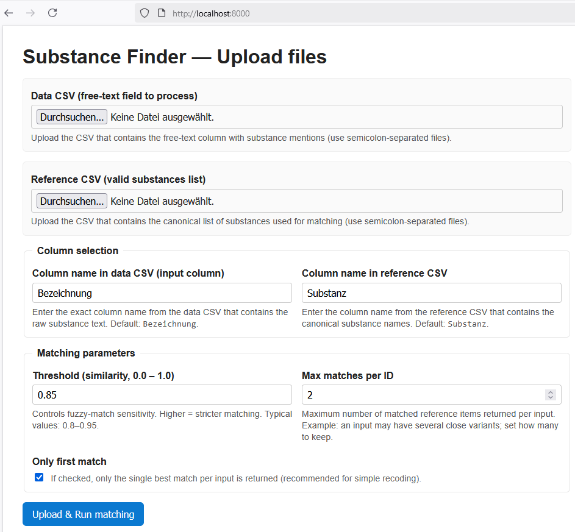
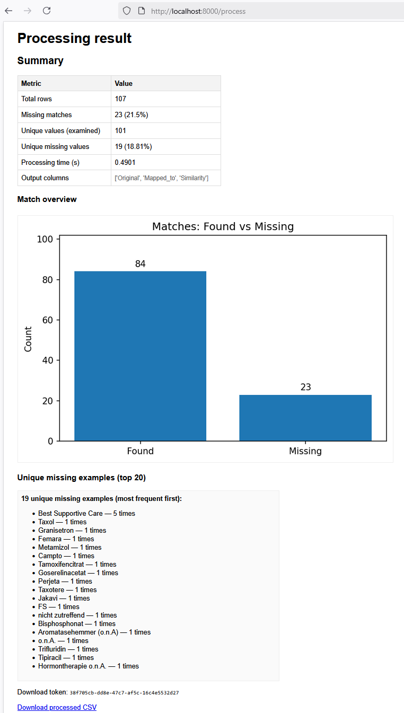
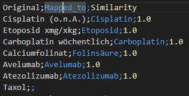

# 🧪 Substance Finder App

This is a simple web app for matching substances in a **data CSV**
against a **reference CSV**.\
It uses [Flask](https://flask.palletsprojects.com/),
[pandas](https://pandas.pydata.org/), [spaCy](https://spacy.io/), and
[spaczz](https://github.com/gandersen101/spaczz) for fuzzy string
matching. The app is based on [spacy_matching](https://github.com/msauerberg/spacy_matching).

The app provides: - A **web interface** to upload two CSV files (data +
reference). - Input fields to configure the **column names** and
**matching parameters**. - A processed CSV file you can **download**. -
Basic **statistics** and a **bar chart** (found vs. missing matches).

------------------------------------------------------------------------

## 🚀 Features

-   Upload **two CSV files**:
    -   *Data CSV*: contains substances to process.\
    -   *Reference CSV*: contains valid substance names.\
-   Configure **column names** and matching parameters directly in the
    form.\
-   Download the processed results as a CSV (semicolon `;` separated).\
-   See statistics (how many matches found, how many missing, and top
    missing substances).\
-   Local-only: no external storage, runs entirely on your machine.

------------------------------------------------------------------------

## 📂 Project Structure

    .
    ├── app.py             # Flask app
    ├── processor.py       # Processing logic (fuzzy matching etc.)
    ├── templates/         # HTML templates
    │   ├── form.html      # Upload page
    │   └── result.html    # Result page
    ├── Dockerfile         # For containerized deployment
    ├── requirements.txt   # Python dependencies
    ├── README.md          # Project documentation
    └── sample_data/       # Example CSVs (for testing)

------------------------------------------------------------------------

## ⚙️ Installation

You can run the app in **two ways**:

### 🔹 1. Local Python Environment

1.  Clone this repository:

    ``` bash
    git clone https://github.com/msauerberg/substance-finder.git
    cd substance-finder
    ```

2.  Create a virtual environment and install dependencies:

    ``` bash
    python3.12 -m venv venv
    source venv/bin/activate   # (Linux/macOS)
    venv\Scripts\activate      # (Windows PowerShell)

    pip install -r requirements.txt
    ```

3.  Run the app:

    ``` bash
    python app.py
    ```

4.  Open your browser at:

        http://localhost:8020

------------------------------------------------------------------------

### 🔹 2. Run with Docker (recommended)

1.  Clone this repository:

    ``` bash
    git clone https://github.com/msauerberg/substance-finder.git
    cd substance-finder
    ```

2.  Build the image:

    ``` bash
    docker build -t substance-finder .
    ```

3.  Run the container:

    ``` bash
    docker run -it --rm -p 8020:8020 substance-finder
    ```

4.  Open in your browser:

        http://localhost:8020

------------------------------------------------------------------------

## 📊 Example Usage

1.  Upload your **data CSV** (with substances to process).\
2.  Upload your **reference CSV** (list of valid substances).\
3.  Adjust column names and parameters if needed.\
4.  Click **Upload & Run Matching**.\
5.  After processing, you'll see:
    -   A summary table and bar chart.\
    -   A **Download** button to save the processed CSV.
6. The column 'Original' contains the rows provided by the uploaded file. 'Mapped_to' is the match found when comparing against the substance reference list. 'Similarity' gives the similarity between both column, i.e., a higher value means more reliability. The threshold can be adjusted (default is 0.85 - only matches with at least 0.85 similarity are considered). Also, the number of matches can be adjusted (an input can have more than one potential matches).

------------------------------------------------------------------------

## 🖼️ Screenshots

### Upload Page



### Result Page



### Output File



------------------------------------------------------------------------

## 🧑‍💻 Development Notes

-   Default CSV separator is **semicolon (`;`)**.\
-   Output is saved as `processed_substances.csv`.\
-   By default, only the **latest run** file is available for download.\
-   For cleanup, restart the app or manually clear the `/app/tmp/`
    folder.

------------------------------------------------------------------------

## 📝 License

MIT License --- feel free to use, modify, and share.
