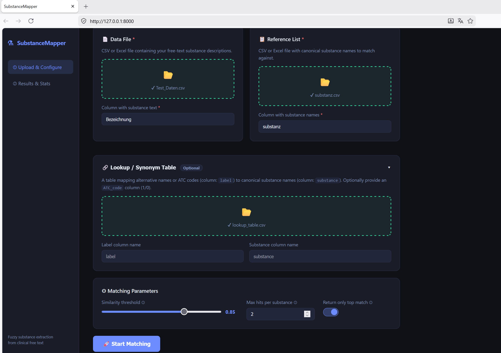
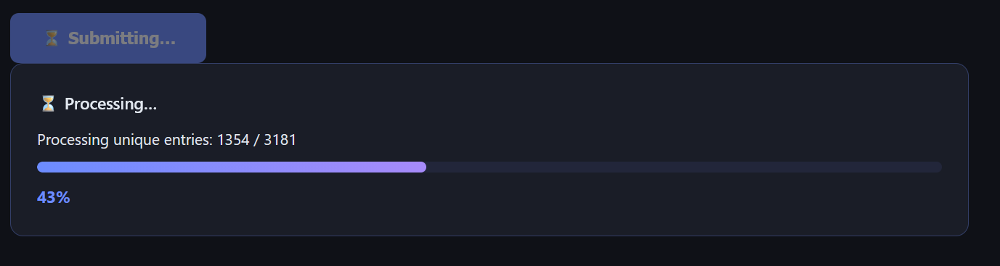
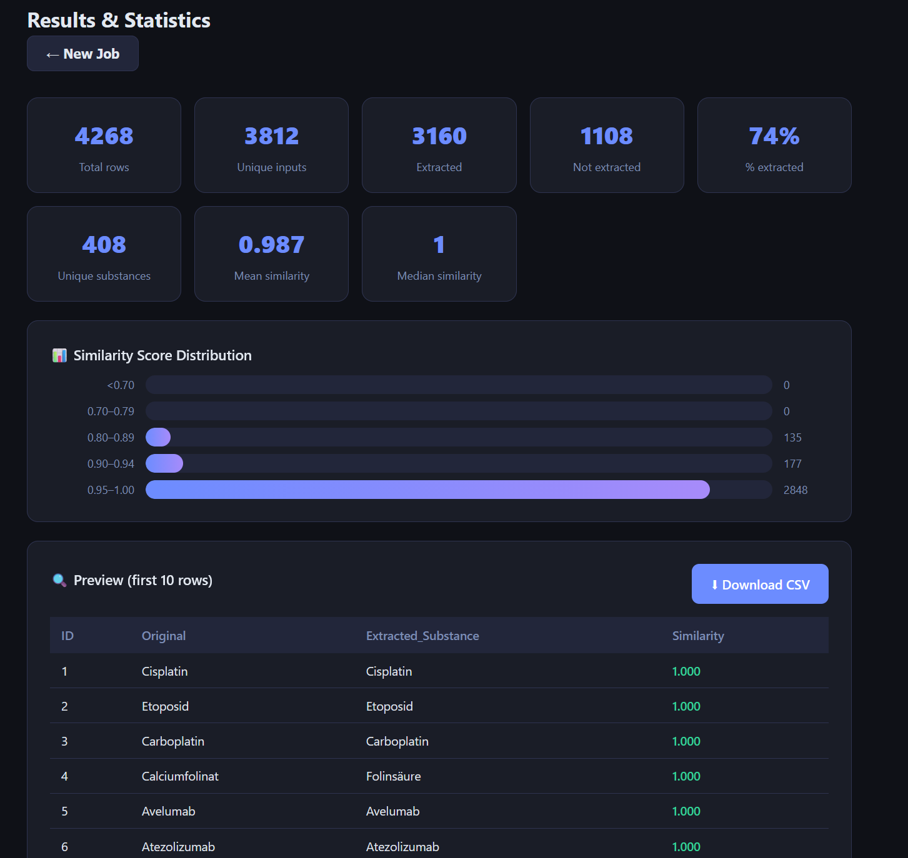

# SubstanceMapper

Fuzzy substance extraction from clinical free-text fields, served as a web app.

## Quick start

### With Docker

```bash
docker build -t substance-mapper .
docker run -p 8000:8000 substance-mapper
```

### Local development

```bash
pip install -r requirements.txt
uvicorn main:app --reload --port 8000
```

Then open **http://localhost:8000** in your browser.

---

## How it works

1. **Upload your data file** (CSV or Excel). Specify which column contains the free-text substance descriptions (e.g. `"Paclitaxol 5mg weekly"`).
2. **Upload a reference list** (CSV or Excel). This is your list of canonical substance names. Specify the column name.
3. **Optionally upload a lookup/synonym table** with columns `label` (alternative names, ATC codes) and `substance` (canonical name). An optional `ATC_code` column (1/0) flags ATC codes for exact matching.
4. **Adjust matching parameters:**
   - *Similarity threshold* — minimum fuzzy-match ratio (0–1). Default 0.85.
   - *Max hits per substance* — maximum times the same substance can be returned per row. Default 2.
   - *Return only top match* — if checked, only the best hit per row is included.
5. **Click Start Matching.** A progress bar tracks unique values being processed.
6. **Download the result CSV.** Summary statistics and a preview table are shown after processing.

## Performance note

The matcher runs on **unique preprocessed values** only, then joins results back to all rows. This means 10 000 rows with 500 unique substances → only 500 matching operations, not 10 000.

## File structure

```
substance_app/
├── main.py              # FastAPI app (routes, job management)
├── app/
│   ├── utils.py         # Core preprocessing + fuzzy matching logic
│   └── recoding.py      # High-level pipeline (add_substance, add_protocol)
├── templates/
│   └── index.html       # Single-page UI
├── static/
│   ├── css/style.css
│   └── js/app.js
├── results/             # Output CSVs (created at runtime)
├── requirements.txt
├── Dockerfile
└── docker-compose.yml
```

## Input file formats

| File | Required columns |
|------|-----------------|
| Data file | Any column you specify as "substance column" |
| Reference list | Any column you specify as "reference column" |
| Lookup table | `label`, `substance` (optionally `ATC_code`) |

CSV files are auto-detected for `;`, `,`, or tab separators.




## Output columns

| Column | Description |
|--------|-------------|
| *(original columns)* | All columns from the input data file |
| `Original` | The raw substance text from the input |
| `Extracted_Substance` | Best matched canonical name (or all matches if multi-match mode) |
| `Similarity` | Match score in [0, 1] |


